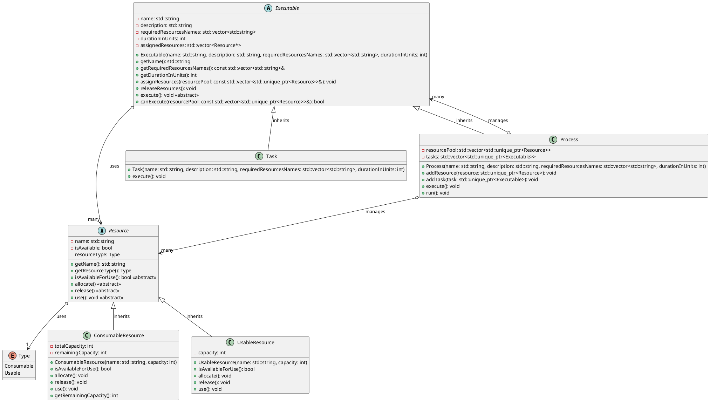

```plantuml
@startuml

' Abstract classes
abstract class Resource {
  -name: std::string
  -isAvailable: bool
  -resourceType: Type
  +getName(): std::string
  +getResourceType(): Type
  +isAvailableForUse(): bool <<abstract>>
  +allocate() <<abstract>>
  +release() <<abstract>>
  +use(): void <<abstract>>
}

enum Type {
  Consumable
  Usable
}

class ConsumableResource {
  -totalCapacity: int
  -remainingCapacity: int
  +ConsumableResource(name: std::string, capacity: int)
  +isAvailableForUse(): bool
  +allocate(): void
  +release(): void
  +use(): void
  +getRemainingCapacity(): int
}

class UsableResource {
  -capacity: int
  +UsableResource(name: std::string, capacity: int)
  +isAvailableForUse(): bool
  +allocate(): void
  +release(): void
  +use(): void
}

abstract class Executable {
  -name: std::string
  -description: std::string
  -requiredResourcesNames: std::vector<std::string>
  -durationInUnits: int
  -assignedResources: std::vector<Resource*>
  +Executable(name: std::string, description: std::string, requiredResourcesNames: std::vector<std::string>, durationInUnits: int)
  +getName(): std::string
  +getRequiredResourcesNames(): const std::vector<std::string>&
  +getDurationInUnits(): int
  +assignResources(resourcePool: const std::vector<std::unique_ptr<Resource>>&): void
  +releaseResources(): void
  +execute(): void <<abstract>>
  +canExecute(resourcePool: const std::vector<std::unique_ptr<Resource>>&): bool
}

class Task {
  +Task(name: std::string, description: std::string, requiredResourcesNames: std::vector<std::string>, durationInUnits: int)
  +execute(): void
}

class Process {
  -resourcePool: std::vector<std::unique_ptr<Resource>>
  -tasks: std::vector<std::unique_ptr<Executable>>
  +Process(name: std::string, description: std::string, requiredResourcesNames: std::vector<std::string>, durationInUnits: int)
  +addResource(resource: std::unique_ptr<Resource>): void
  +addTask(task: std::unique_ptr<Executable>): void
  +execute(): void
  +run(): void
}

' Relationships
Resource o--> "1" Type : uses
ConsumableResource -up-|> Resource : inherits
UsableResource -up-|> Resource : inherits
Executable o--> "many" Resource : uses
Task -up-|> Executable : inherits
Process -up-|> Executable : inherits
Process o--> "many" Resource : manages
Process o--> "many" Executable : manages

@enduml
```
